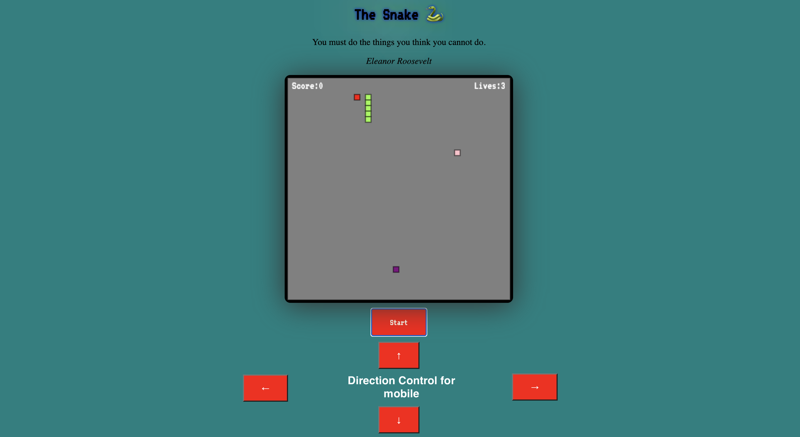
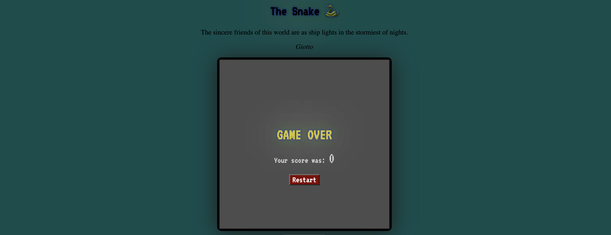

# The Snake

## Game Description

A Classic Snake Game With A Twist

## Game Link

Game Demo Link : https://edlynkohh.github.io/The-Snake/.

## Technologies

<li> HTML
<li> CSS
<li> JavaScript
<li> AJAX
<li> JQuery is used to manage DOM manipulation
<li> Canvas

## API used

<li> source code: https://github.com/lukePeavey/quotable

## Game Instructions

<li> Control the snake using keyboard arrows

<li> For mobile version, user may use the arrow key on the screen

<li> Go after the food to score points and speed of the snake will increase
<li> Avoid the poison as it will cost you one live
<li> Avoid the wall as it will lead to immediate death

<li> Red potion serves as an aid to slow down your snake

## Accomplishments

<li> Letting the snake move
<li> Implementing a game over screen when the snake dies
<li> Adding in background music

## Difficulties Faced

<li> Inputting API into my game
<li> Linking the direction control together
<li> Collision detection. Had to search the webpage for some ideas
<li> CSS styling (Beautifying the webpage is not easy)

## Room For Improvements

<li> Adding images to represent the food,poison and potion
<li> Better sound effect
<li> Mobile direction control using touchscreen